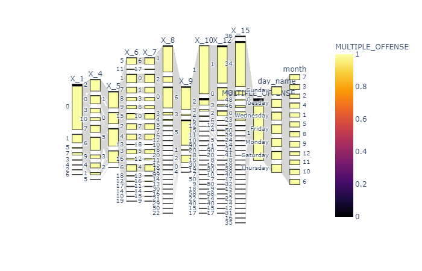

## NorvartisHackathon

For EDA ,interactive model building, visualization, performanceEvaluation kindly 
look at the Jupyter notebooks under notebooks directory

To model build via scripts run 
```
cd src/
python main.py
```

For the purpose of Reusing the scripts the scripts are modularised under the directory src

- config.py
- dataset.py
- engine.py
- evaluation.py
- models.py
- transforms.py
- customClasses.py
- utils.py
- main.py

### config.py
- This file is the config for the whole application /model building
- Any changes in these files will be automatically reflected in the model training, prediction, tunning, etc

### dataset.py
- This file acts as a virtual DB where the dataset was read and keep it in memory
- Along with the train, test, all the feature Engineering was applied to the dataset and stored in memory to be consumed by all models while training and prediction
- All the metadata related to the dataset, like categorical features, time features, etc are also generated by this script


### engine.py
- This File acts as an engine where training the models from different frameworks will be performed, Thanks to the sklearn abstraction which is implemented by all the frameworks.
- All the models we configured, will run parallelly using Jobllib package utilizing the all the cores in the machine
- parallelism code was inspired (taken) from sklearn core package

### evaluation.py
- This is nothing but small evaluation before preparing the submission file or before serializing the trained model
- recall and confusion matrix will be printed while training
- Needs to some extra evaluation in the future

### models.py
- This script prepares a container to hold different model from the different framework in memory which is then used by the engine to train all the model from the container
- we can also specify to use AutoML from h2o

### transforms.py
- contains some transformations needed to enrich (feature Engineering) the dataset
-  Again inspired (taken) from fastai tabular transforms

### customClasses.py
- To implement voting classifier from all the predictions(from CSV) made by the model 
- sklearn doesn't support to build voting classifier from the CSV predictions, so Custom Classifier like `FromFileClassifier` (sklean estimator) and `WrapVotingClassifier` 
- `FromFileClassifier` reads the relevant model CSV and acts as a Dummy classifier which just throws the predictions from the CSV
- `WrapVotingClassifier` builds the soft voting from the given list of Fileclassifiers
- HardVoting can be performed using a separated function `hardVoting`

### utils.py
- contains some utility function

### main.py
- The Entry point for model training
- imports all the necessary items and coordinates the model building and prediction
- after the model is built, based on the command line args, the submission file will be prepared. 

### Just a random EDA plot




